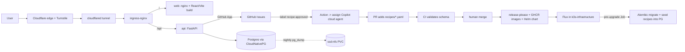

# Nailed It Kitchen

A recipe app for the adulting millennial. Recipes are shown as an easy-to-read **grid**
(ingredients on the left, each cooking action combining them to the right), inspired by the
"Cooking for Engineers" recipe card.

**URL:** https://naileditkitchen.dylanlabs.dev (not live yet)

> **Status:** planning is done and application code has not started. All work is tracked as GitHub issues,
> in order. Start with the pinned **`[S00] Getting started roadmap`** issue.

## Team

- [@dylanwhitetech](https://github.com/dylanwhitetech)
- [@ArthurW2](https://github.com/ArthurW2), Principal Engineer (frontend)

Both of us own the whole repo (see `CODEOWNERS`). Issues are unassigned; pick the next one in the roadmap.

> **Contributions:** this repo is public but does not accept outside issues or PRs.
> Submit recipes and feedback **through the app**.

## Architecture



It runs on a 3-node Raspberry Pi 4 (arm64) k3s cluster managed with Flux in
[dylanwhitetech/k3s-infrastructure](https://github.com/dylanwhitetech/k3s-infrastructure).

## Decisions & why

| Area | Decision | Why |
|------|----------|-----|
| Frontend | React + Vite + TypeScript, Oxlint, Vitest | React is the most common UI library, so help and components are easy to find. Vite gives instant dev reloads and simple builds. TypeScript catches mistakes early. Oxlint and Vitest are fast and fit Vite. |
| Backend | FastAPI (Python 3.12), Ruff, pytest | Typed and fast, generates OpenAPI docs automatically, and Python keeps the API simple. Ruff and pytest are the standard fast lint/test tools. |
| Database | PostgreSQL via the CloudNativePG operator, SQLAlchemy + Alembic | Real relational data (recipes, ingredients, ratings) plus built-in full-text search. CNPG manages Postgres on Kubernetes (failover, backups, status) and can be reused by future apps. Alembic gives versioned migrations. |
| DB storage | `local-path` volume pinned to one node + nightly `pg_dump` to NFS | Running Postgres directly on NFS risks corruption. Local disk is safe and fast; the nightly dump on the NFS share is the backup. |
| Recipe format | YAML files in `recipes/`, checked by a JSON Schema | Recipes are code: reviewable in PRs, versioned, and easy for Copilot to write. The schema keeps the grid renderer simple and safe. |
| Recipe submissions | GitHub-native: form → issue → `recipe:approved` label → Copilot cloud agent opens a PR → CI → human merge | No admin UI or moderation queue to build. GitHub gives review, history and automation for free. |
| Feedback | Ratings and "I made this" in Postgres; app feedback opens an issue | Quick signals live with the data; real feedback lands where we work. |
| Accounts | None in v1; Cloudflare Turnstile + API rate limits | No passwords or personal data to protect. Turnstile blocks bots without annoying captchas. |
| Photos | Not in v1 | Keeps storage and moderation simple; a research issue covers it later. |
| Containers | Docker Desktop for local dev; multi-arch (amd64/arm64) images on GHCR; k3s runs them with containerd | The same images run on laptops, in CI and on the Pis. `docker compose` starts the whole stack locally with one command. |
| Hosting | Helm chart → OCI on GHCR → Flux in k3s-infrastructure; Cloudflare Tunnel → ingress-nginx | GitOps: the cluster state is in git and every change is a reviewed PR. The tunnel avoids opening home ports and Cloudflare handles TLS. |
| GitHub from the API | GitHub App `naileditkitchen-bot` (issues: write only) | Narrow permissions and short-lived tokens instead of a personal token. |
| Styling | Decided by @ArthurW2 (issue S14) | Our frontend expert picks the approach. |
| AI-first | Copilot custom agents, skills and instructions in `.github/` | Copilot follows the same rules as humans, and anyone can hand it an issue. |

## How recipe submission works

1. Someone fills in the **Submit a recipe** form in the app (free text is fine). Turnstile checks they're human.
2. The API (as `naileditkitchen-bot`) opens a GitHub issue labeled `recipe:submission` and locks it.
   *Submissions are public; the form says so.*
3. A maintainer reads it and adds the `recipe:approved` label.
4. A GitHub Action assigns the **Copilot cloud agent**, which uses the `recipe-grid-author` skill to turn the text into `recipes/<slug>.yaml` and opens a PR.
5. CI validates the YAML against the schema; a maintainer reviews and merges.
6. release-please ships a release; Flux deploys it; a pre-upgrade Job migrates the DB and seeds the new recipe.

## v1 scope

**In:** browse recipes, search + tag filter (Postgres full-text search), grid recipe view (mobile-friendly),
submit-a-recipe form, app feedback form, star ratings and "I made this".

**Out (Future):** photos, user accounts, comments, servings scaling, print view, in-browser AI recipe conversion.

## Run & test locally (Docker)

> **Placeholder:** the real commands land with issue **S15** (docker-compose). Keep this section accurate;
> S15 is only done when these commands work exactly as written.

**Do this before every push.**

1. Install and start **Docker Desktop**. Check it works: `docker compose version`.
2. Copy `.env.example` to `.env` (no real secrets needed locally).
3. Start everything: `docker compose up --build`
   - Web: http://localhost:8080
   - API: http://localhost:8000 (docs at http://localhost:8000/docs)
   - Postgres: `localhost:5432`
4. Run the tests (exact commands added in S12/S13/S16; the `local-preflight` skill runs them all).
5. Reset the database: `docker compose down -v`

## AI-first workflow

Everything Copilot needs is in the repo, so it works the same in VS Code, the GitHub Copilot app,
the Copilot CLI and the Copilot cloud agent on GitHub.

| File | What it does |
|------|--------------|
| `.github/copilot-instructions.md` | Main rules for Copilot (source of truth). `AGENTS.md` points to it. |
| `.github/instructions/*.instructions.md` | Extra rules for certain paths (e.g. code review, Copilot files). |
| `.github/agents/naileditkitchen-dev.agent.md` | **Main developer agent.** Use it for almost everything. |
| `.github/agents/copilot-author.agent.md` | Writes new agents/skills/instructions from awesome-copilot + official docs. |
| `.github/agents/naileditkitchen-code-review.agent.md` | Quick, cheap local review before you push. |
| `.github/agents/naileditkitchen-k3s-ops.agent.md` | Read-only cluster triage (needs a kubeconfig, local only). |
| `.github/skills/gh-issue-drafter/` | Opens issues the right way (templates, labels, epics, dependencies). |
| `.github/skills/gh-pr-drafter/` | Opens PRs the right way (template, Conventional Commits). |

**New to agentic work? Try this:**

1. **VS Code:** open the repo, open Copilot Chat, pick **naileditkitchen-dev** from the agent dropdown, and say
   "Work on issue #<n>". It reads the issue, writes code and tests, and can hand off to the reviewer.
2. **GitHub Copilot app / CLI:** open the repo, select the `naileditkitchen-dev` agent (`/agent`), and give it the issue.
3. **Cloud agent on GitHub:** on an issue marked `Copilot-ready? yes`, assign it to **Copilot**. It opens a PR for you to review.
4. Always review the PR yourself. Copilot code review also comments automatically.

## Repo layout (planned)

```text
frontend/        React + Vite app
backend/         FastAPI app, Alembic migrations, recipe seeder
recipes/         Recipe YAML + JSON Schema
recipes/source/  Original recipes used as test fixtures
deploy/chart/    Helm chart
docs/            Architecture, operations, runbooks, API
observability/   Grafana dashboards
.github/         Copilot agents, skills, instructions, templates, workflows
```

## Related repos

- [dylanwhitetech/k3s-infrastructure](https://github.com/dylanwhitetech/k3s-infrastructure): cluster, Flux, Cloudflare Tunnel, CloudNativePG, secrets
